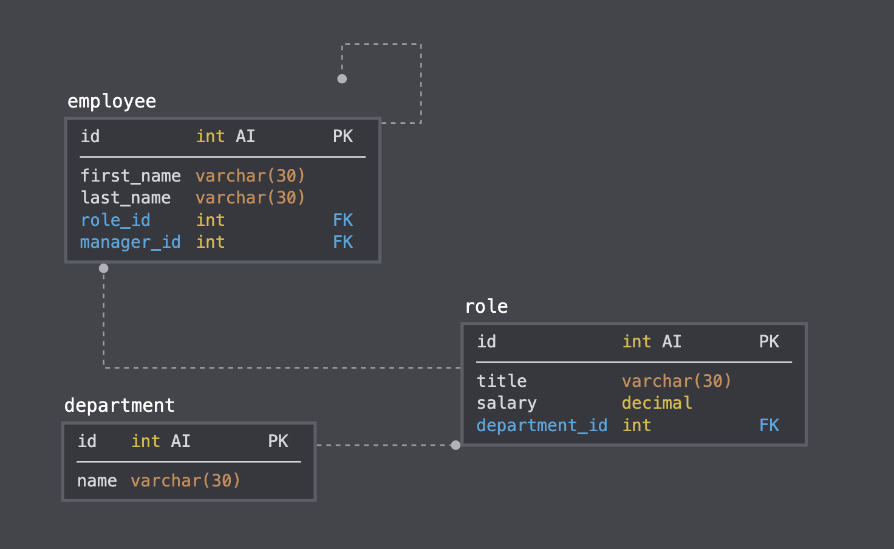
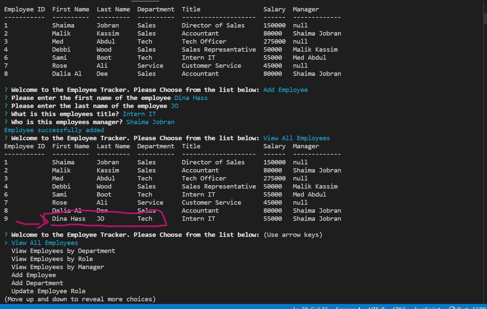

## Employee Tracker

<!-- TABLE OF CONTENTS -->

  
Table of Contents

  <ul>
    <li>
      <ul>
        <li><a href="#User Story">User Story</a></li>
        <li><a href="#Instructions">Instructions</a></li>
          <li><a href="#Built With">Built With</a></li>
          <li><a href="#Deployed Links">Deployed Links</a></li>
         <li><a href="#Screenshot">Screenshot</a></li>
        <li><a href="#Contact">Contact</a></li>
      </ul>
    </li>
    </ul>

Developers are often tasked with creating interfaces that make it easy for non-developers to view and interact with information stored in databases. Often these interfaces are known as **C**ontent **M**anagement **S**ystems. In this homework assignment, your challenge is to architect and build a solution for managing a company's employees using node, inquirer, and MySQL.
## User Story

As a business owner
I want to be able to view and manage the departments, roles, and employees in my company
So that I can organize and plan my business
``

## Instructions

Design the following database schema containing three tables:

* **department**:

  * **id** - INT PRIMARY KEY
  * **name** - VARCHAR(30) to hold department name

* **role**:

  * **id** - INT PRIMARY KEY
  * **title** -  VARCHAR(30) to hold role title
  * **salary** -  DECIMAL to hold role salary
  * **department_id** -  INT to hold reference to department role belongs to

* **employee**:

  * **id** - INT PRIMARY KEY
  * **first_name** - VARCHAR(30) to hold employee first name
  * **last_name** - VARCHAR(30) to hold employee last name
  * **role_id** - INT to hold reference to role employee has
  * **manager_id** - INT to hold reference to another employee that manages the employee being Created. This field may be null if the employee has no manager
  
Build a command-line application that at a minimum allows the user to:

  * Add departments, roles, employees

  * View departments, roles, employees

  * Update employee roles

Bonus points if you're able to:

  * Update employee managers

  * View employees by manager

  * Delete departments, roles, and employees

  * View the total utilized budget of a department -- ie the combined salaries of all employees in that department

## Built with
   * Mysql
   * JS
   * npm
   

## Deployed Links
[Youtube link](https://youtu.be/123RDWMdrSk)

[link github](https://github.com/shaimajobran/employee-tracker)

## screenshot

## Contact
If you have any questions about the repo, contact me at [shaimajobran](https://github.com/shaimajobran).

